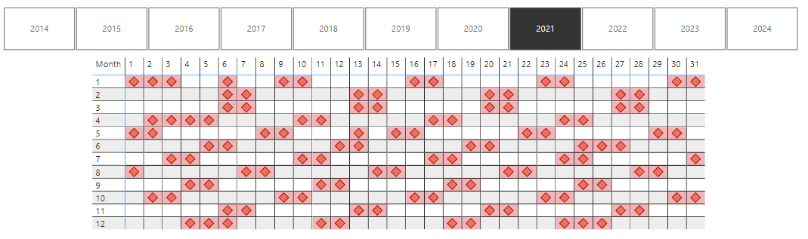

# tools-and-scripts
Various tools and scripts, mainly for data handling

# Power BI Calendar

[Calendar Query](PBI/calendar.pq)

(autogenerated with ChatGPT)

This Power Query script generates a calendar table with comprehensive date-related columns and includes functionality to determine if the office is open on a specific date. The script is tailored for Finland but can be adapted for other countries.

## Columns and Their Functions

### Basic Date Information
- **Date**: The main date column in the table.
- **Year**: The year of the date.
- **Start of Year**: The first day of the year.
- **End of Year**: The last day of the year.
- **Month**: The month number (1–12).
- **Start of Month**: The first day of the month.
- **End of Month**: The last day of the month.
- **Days in Month**: The total number of days in the month.
- **Day**: The day of the month.
- **Day Name**: The name of the day (e.g., Monday).
- **Day of Week**: The numerical representation of the day of the week (e.g., Monday = 0).
- **Day of Year**: The ordinal day number in the year (e.g., January 1 = 1).
- **Month Name**: The full name of the month (e.g., January).
- **Quarter**: The quarter of the year (1–4).
- **Start of Quarter**: The first day of the quarter.
- **End of Quarter**: The last day of the quarter.

### Week Information
- **Week of Year**: The week number within the year, using the first day of the week setting.
- **Week of Year ISO**: The week number following ISO 8601 standards.
- **Week of Month**: The week number within the month.
- **Start of Week**: The first day of the week.
- **End of Week**: The last day of the week.
- **Adjusted Week Year**: Corrects the year for week numbering when the year changes mid-week.

### Fiscal Year Information
- **Fiscal Year**: The fiscal year the date belongs to, based on a custom fiscal year start month.
- **Fiscal Quarter**: The quarter within the fiscal year (1–4).
- **Fiscal Month**: The month number adjusted for the fiscal year.

### Holiday and Office Information
- **Is Public Holiday**: Indicates if the date is a public holiday, including fixed and movable holidays like Easter and Midsummer.
- **Is Office Open**: A boolean value that determines whether the office is open, considering public holidays and weekends.

### Relative Date Offsets
- **Day Offset**: The difference in days between the date and today.
- **Month Offset**: The difference in months between the date and today.
- **Year Offset**: The difference in years between the date and today.
- **Quarter Offset**: The difference in quarters between the date and today.

## Key Features
1. **Holiday Calculation**:
   - Fixed holidays (e.g., Christmas).
   - Movable holidays (e.g., Good Friday, Midsummer).
2. **ISO 8601 Compliance**:
   - Corrects week numbering when the year changes mid-week.
3. **Custom Fiscal Year Support**:
   - Adjusts months, quarters, and years based on the fiscal year start month.

## Customization
The script can be easily modified for different countries or scenarios by:
- Updating the `FixedOfficeClosedDates` list.
- Adjusting fiscal year settings (`setting_StartofFiscalYear`).
- Changing the first day of the week (`setting_FirstDayOfWeek`).